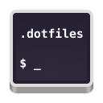

[][repository-github-url]

# [dotfiles][repository-github-url]

> TBD

After going way too far down the UNIX history rabbit hole years ago, I came up with the mildly deranged idea of building dotfiles that were POSIX-compliant, shell-agnostic, platform-agnostic, fully modular, and infinitely extensible. The result was predictable: they never really reached a stable, usable state.

This repo is the more realistic, grown-up version. It supports Linux and macOS, with Bash and Zsh only.

---

Copyright © 2026 ([MIT][repository-license-url]) [Christian Grete][repository-owner-url]

[repository-github-url]: https://github.com/ChristianGrete/dotfiles
[repository-license-url]: LICENSE
[repository-owner-url]: https://christiangrete.com